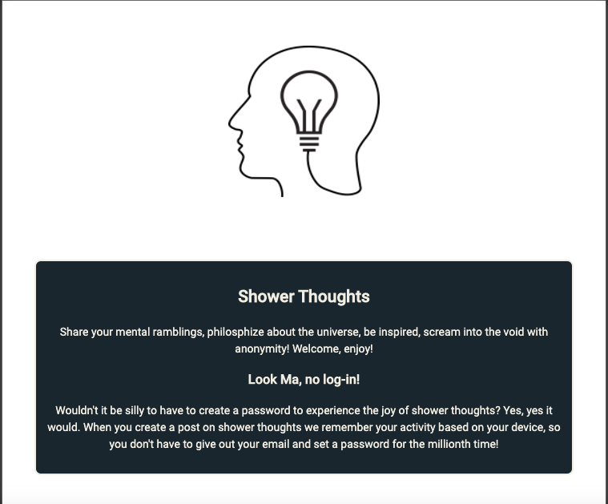
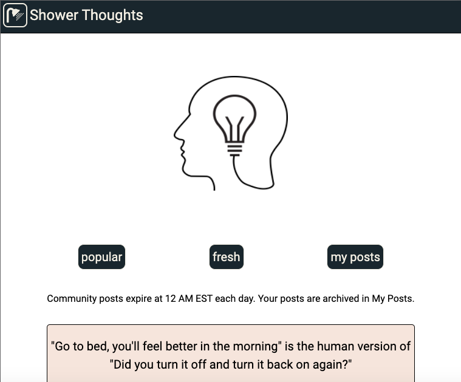

## Shower Thoughts

[live link](https://showerthoughts-client.challey17.vercel.app/)

App for sharing "shower thoughts" - brief observations about life that are often humorous. Users are given an Id that is stored in their device local storage which allows for user-specific data without a login/password. Users can post once per day. All community posts expire and feeds are reset at 12am EST each day. A user's individual posts are archived in "my posts" feed.

### App Photos

### Technology

Front End: HTML5, CSS3, JavaScript ES6, React
Back End: Node.js, Express.js, Mocha, Chai, RESTful API Endpoints, PostgresSQL
